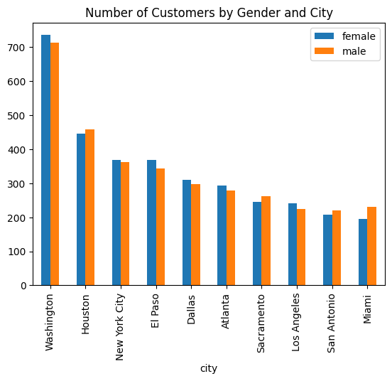

**© 2022 Scott A. Bruce. Do not distribute.**

# 1. SQL Alchemy to load data into Python


```python
from sqlalchemy import create_engine
import pandas as pd # if you see pd, that means it's a function or object coming from pandas packages. 
from IPython.core.interactiveshell import InteractiveShell # the below two lines allow us to see things interactively. 
InteractiveShell.ast_node_interactivity = "all"
```


```python
%matplotlib inline # everytime we plot sth. with matplotlib we want to see it inline with the code. 
```


```python
# psycopg2 is the underline function that actually runs in your database. 
cnxn_string = ("postgresql+psycopg2://{username}:{pswd}"  # we need to define things in the curly brackets
              "@{host}:{port}/{database}")
print(cnxn_string)
```

    postgresql+psycopg2://{username}:{pswd}@{host}:{port}/{database}
    


```python
# creates an object engine by calling create_engine function.
# the first input to the function is cnxn_string, you specified previously. However, we need to format it by adding in the 
# specific part of the strings corresponding to our username, pswd, ..., database. 
# .format() allows us to specify the function. 
engine = create_engine(cnxn_string.format(
    username="postgres",
    pswd="behappy",
    host="postgres",
    port=5432,
    database="sqlda"))

# just to verify it works, once engine is created, we execute a simple query "select..." to show it works. 
engine.execute("SELECT * FROM customers LIMIT 2;").fetchall()  # fetch all -> excute it 
```


    [(1, None, 'Arlena', 'Riveles', None, 'ariveles0@stumbleupon.com', 'F', '98.36.172.246', None, None, None, None, None, None, None, datetime.datetime(2017, 4, 23, 0, 0)),
     (2, 'Dr', 'Ode', 'Stovin', None, 'ostovin1@npr.org', 'M', '16.97.59.186', '314-534-4361', '2573 Fordem Parkway', 'Saint Louis', 'MO', '63116', 38.5814, -90.2625, datetime.datetime(2014, 10, 2, 0, 0))]


```python
customers_data = pd.read_sql_table('customers',engine) # function, read_sql_table, takes 2 inputs: the name of the table 
# you want to read ('customer') and engine which allows us to connect to database. 
```


```python
query = """select city, count(*) as number_of_customers,
           count(nullif(gender,'M')) as female,
           count(nullif(gender,'F')) as male
           from customers
           where city is not null
           group by city
           order by number_of_customers desc
           limit 10"""        # three double quotes are a way to specify the query. 
```


```python
top_cities_data = pd.read_sql_query(query,engine) # use another funcion within pd and pass query to it instead of passing name
# of the table. It connects to the DB using the connection you provided, run the query and brings all results into a pandas DF 
# calling top_cities_data. 
```


```python
top_cities_data
```


<div>
<style scoped>
    .dataframe tbody tr th:only-of-type {
        vertical-align: middle;
    }

    .dataframe tbody tr th {
        vertical-align: top;
    }

    .dataframe thead th {
        text-align: right;
    }
</style>
<table border="1" class="dataframe">
  <thead>
    <tr style="text-align: right;">
      <th></th>
      <th>city</th>
      <th>number_of_customers</th>
      <th>female</th>
      <th>male</th>
    </tr>
  </thead>
  <tbody>
    <tr>
      <th>0</th>
      <td>Washington</td>
      <td>1447</td>
      <td>734</td>
      <td>713</td>
    </tr>
    <tr>
      <th>1</th>
      <td>Houston</td>
      <td>904</td>
      <td>446</td>
      <td>458</td>
    </tr>
    <tr>
      <th>2</th>
      <td>New York City</td>
      <td>731</td>
      <td>369</td>
      <td>362</td>
    </tr>
    <tr>
      <th>3</th>
      <td>El Paso</td>
      <td>713</td>
      <td>369</td>
      <td>344</td>
    </tr>
    <tr>
      <th>4</th>
      <td>Dallas</td>
      <td>607</td>
      <td>309</td>
      <td>298</td>
    </tr>
    <tr>
      <th>5</th>
      <td>Atlanta</td>
      <td>571</td>
      <td>292</td>
      <td>279</td>
    </tr>
    <tr>
      <th>6</th>
      <td>Sacramento</td>
      <td>506</td>
      <td>244</td>
      <td>262</td>
    </tr>
    <tr>
      <th>7</th>
      <td>Los Angeles</td>
      <td>466</td>
      <td>241</td>
      <td>225</td>
    </tr>
    <tr>
      <th>8</th>
      <td>San Antonio</td>
      <td>426</td>
      <td>207</td>
      <td>219</td>
    </tr>
    <tr>
      <th>9</th>
      <td>Miami</td>
      <td>426</td>
      <td>195</td>
      <td>231</td>
    </tr>
  </tbody>
</table>
</div>


```python
# After set into pandas DF, we can do all the typical stuff: visualization, manipulation, produce models etc. 
ax = top_cities_data.plot.bar('city',y=['female','male'],
                              title='Number of Customers by Gender and City')
```


    

    


# 2. Writing data to database using Python


```python
# pass DF back to DB using engine bridge. 
top_cities_data.to_sql('top_cities_data',engine,
                       index=False,if_exists='replace') # additional inputs you want to specify. 
```


```python
#get help using the help function
help('pandas.DataFrame.to_sql')
```

    Help on function to_sql in pandas.DataFrame:
    
    pandas.DataFrame.to_sql = to_sql(self, name: 'str', con, schema=None, if_exists: 'str' = 'fail', index: 'bool_t' = True, index_label=None, chunksize=None, dtype: 'DtypeArg | None' = None, method=None) -> 'None'
        Write records stored in a DataFrame to a SQL database.
        
        Databases supported by SQLAlchemy [1]_ are supported. Tables can be
        newly created, appended to, or overwritten.
        
        Parameters
        ----------
        name : str
            Name of SQL table.
        con : sqlalchemy.engine.(Engine or Connection) or sqlite3.Connection
            Using SQLAlchemy makes it possible to use any DB supported by that
            library. Legacy support is provided for sqlite3.Connection objects. The user
            is responsible for engine disposal and connection closure for the SQLAlchemy
            connectable See `here                 <https://docs.sqlalchemy.org/en/13/core/connections.html>`_.
        
        schema : str, optional
            Specify the schema (if database flavor supports this). If None, use
            default schema.
        if_exists : {'fail', 'replace', 'append'}, default 'fail'
            How to behave if the table already exists.
        
            * fail: Raise a ValueError.
            * replace: Drop the table before inserting new values.
            * append: Insert new values to the existing table.
        
        index : bool, default True
            Write DataFrame index as a column. Uses `index_label` as the column
            name in the table.
        index_label : str or sequence, default None
            Column label for index column(s). If None is given (default) and
            `index` is True, then the index names are used.
            A sequence should be given if the DataFrame uses MultiIndex.
        chunksize : int, optional
            Specify the number of rows in each batch to be written at a time.
            By default, all rows will be written at once.
        dtype : dict or scalar, optional
            Specifying the datatype for columns. If a dictionary is used, the
            keys should be the column names and the values should be the
            SQLAlchemy types or strings for the sqlite3 legacy mode. If a
            scalar is provided, it will be applied to all columns.
        method : {None, 'multi', callable}, optional
            Controls the SQL insertion clause used:
        
            * None : Uses standard SQL ``INSERT`` clause (one per row).
            * 'multi': Pass multiple values in a single ``INSERT`` clause.
            * callable with signature ``(pd_table, conn, keys, data_iter)``.
        
            Details and a sample callable implementation can be found in the
            section :ref:`insert method <io.sql.method>`.
        
        Raises
        ------
        ValueError
            When the table already exists and `if_exists` is 'fail' (the
            default).
        
        See Also
        --------
        read_sql : Read a DataFrame from a table.
        
        Notes
        -----
        Timezone aware datetime columns will be written as
        ``Timestamp with timezone`` type with SQLAlchemy if supported by the
        database. Otherwise, the datetimes will be stored as timezone unaware
        timestamps local to the original timezone.
        
        References
        ----------
        .. [1] https://docs.sqlalchemy.org
        .. [2] https://www.python.org/dev/peps/pep-0249/
        
        Examples
        --------
        Create an in-memory SQLite database.
        
        >>> from sqlalchemy import create_engine
        >>> engine = create_engine('sqlite://', echo=False)
        
        Create a table from scratch with 3 rows.
        
        >>> df = pd.DataFrame({'name' : ['User 1', 'User 2', 'User 3']})
        >>> df
             name
        0  User 1
        1  User 2
        2  User 3
        
        >>> df.to_sql('users', con=engine)
        >>> engine.execute("SELECT * FROM users").fetchall()
        [(0, 'User 1'), (1, 'User 2'), (2, 'User 3')]
        
        An `sqlalchemy.engine.Connection` can also be passed to `con`:
        
        >>> with engine.begin() as connection:
        ...     df1 = pd.DataFrame({'name' : ['User 4', 'User 5']})
        ...     df1.to_sql('users', con=connection, if_exists='append')
        
        This is allowed to support operations that require that the same
        DBAPI connection is used for the entire operation.
        
        >>> df2 = pd.DataFrame({'name' : ['User 6', 'User 7']})
        >>> df2.to_sql('users', con=engine, if_exists='append')
        >>> engine.execute("SELECT * FROM users").fetchall()
        [(0, 'User 1'), (1, 'User 2'), (2, 'User 3'),
         (0, 'User 4'), (1, 'User 5'), (0, 'User 6'),
         (1, 'User 7')]
        
        Overwrite the table with just ``df2``.
        
        >>> df2.to_sql('users', con=engine, if_exists='replace',
        ...            index_label='id')
        >>> engine.execute("SELECT * FROM users").fetchall()
        [(0, 'User 6'), (1, 'User 7')]
        
        Specify the dtype (especially useful for integers with missing values).
        Notice that while pandas is forced to store the data as floating point,
        the database supports nullable integers. When fetching the data with
        Python, we get back integer scalars.
        
        >>> df = pd.DataFrame({"A": [1, None, 2]})
        >>> df
             A
        0  1.0
        1  NaN
        2  2.0
        
        >>> from sqlalchemy.types import Integer
        >>> df.to_sql('integers', con=engine, index=False,
        ...           dtype={"A": Integer()})
        
        >>> engine.execute("SELECT * FROM integers").fetchall()
        [(1,), (None,), (2,)]
    
    


```python
#but what if you can't remember the name of the function?

#using tab and shift+tab for help in Jupyter notebooks
pd.pandas.DataFrame
#now press tab, which will bring up all possible functions, so you can find the one you are looking for
pd.pandas.DataFrame.to_sql
#now press shift+tab, which will bring up the help file and input arguments (in case you forget them)
```


    pandas.core.frame.DataFrame


    <function pandas.core.generic.NDFrame.to_sql(self, name: 'str', con, schema=None, if_exists: 'str' = 'fail', index: 'bool_t' = True, index_label=None, chunksize=None, dtype: 'DtypeArg | None' = None, method=None) -> 'None'>


# 3. Reading and writing CSV files with Python


```python
# index is like a row index ex. 0,1,2..., if index=True, it will create a seperate column at the beginning. 
top_cities_data.to_csv('top_cities_analysis.csv',index=False) 
my_data=pd.read_csv('top_cities_analysis.csv')
my_data
```


<div>
<style scoped>
    .dataframe tbody tr th:only-of-type {
        vertical-align: middle;
    }

    .dataframe tbody tr th {
        vertical-align: top;
    }

    .dataframe thead th {
        text-align: right;
    }
</style>
<table border="1" class="dataframe">
  <thead>
    <tr style="text-align: right;">
      <th></th>
      <th>city</th>
      <th>number_of_customers</th>
      <th>female</th>
      <th>male</th>
    </tr>
  </thead>
  <tbody>
    <tr>
      <th>0</th>
      <td>Washington</td>
      <td>1447</td>
      <td>734</td>
      <td>713</td>
    </tr>
    <tr>
      <th>1</th>
      <td>Houston</td>
      <td>904</td>
      <td>446</td>
      <td>458</td>
    </tr>
    <tr>
      <th>2</th>
      <td>New York City</td>
      <td>731</td>
      <td>369</td>
      <td>362</td>
    </tr>
    <tr>
      <th>3</th>
      <td>El Paso</td>
      <td>713</td>
      <td>369</td>
      <td>344</td>
    </tr>
    <tr>
      <th>4</th>
      <td>Dallas</td>
      <td>607</td>
      <td>309</td>
      <td>298</td>
    </tr>
    <tr>
      <th>5</th>
      <td>Atlanta</td>
      <td>571</td>
      <td>292</td>
      <td>279</td>
    </tr>
    <tr>
      <th>6</th>
      <td>Sacramento</td>
      <td>506</td>
      <td>244</td>
      <td>262</td>
    </tr>
    <tr>
      <th>7</th>
      <td>Los Angeles</td>
      <td>466</td>
      <td>241</td>
      <td>225</td>
    </tr>
    <tr>
      <th>8</th>
      <td>San Antonio</td>
      <td>426</td>
      <td>207</td>
      <td>219</td>
    </tr>
    <tr>
      <th>9</th>
      <td>Miami</td>
      <td>426</td>
      <td>195</td>
      <td>231</td>
    </tr>
  </tbody>
</table>
</div>


```python
help('pandas.read_csv')
```

    Help on function read_csv in pandas:
    
    pandas.read_csv = read_csv(filepath_or_buffer: 'FilePathOrBuffer', sep=<no_default>, delimiter=None, header='infer', names=<no_default>, index_col=None, usecols=None, squeeze=False, prefix=<no_default>, mangle_dupe_cols=True, dtype: 'DtypeArg | None' = None, engine=None, converters=None, true_values=None, false_values=None, skipinitialspace=False, skiprows=None, skipfooter=0, nrows=None, na_values=None, keep_default_na=True, na_filter=True, verbose=False, skip_blank_lines=True, parse_dates=False, infer_datetime_format=False, keep_date_col=False, date_parser=None, dayfirst=False, cache_dates=True, iterator=False, chunksize=None, compression='infer', thousands=None, decimal: 'str' = '.', lineterminator=None, quotechar='"', quoting=0, doublequote=True, escapechar=None, comment=None, encoding=None, encoding_errors: 'str | None' = 'strict', dialect=None, error_bad_lines=None, warn_bad_lines=None, on_bad_lines=None, delim_whitespace=False, low_memory=True, memory_map=False, float_precision=None, storage_options: 'StorageOptions' = None)
        Read a comma-separated values (csv) file into DataFrame.
        
        Also supports optionally iterating or breaking of the file
        into chunks.
        
        Additional help can be found in the online docs for
        `IO Tools <https://pandas.pydata.org/pandas-docs/stable/user_guide/io.html>`_.
        
        Parameters
        ----------
        filepath_or_buffer : str, path object or file-like object
            Any valid string path is acceptable. The string could be a URL. Valid
            URL schemes include http, ftp, s3, gs, and file. For file URLs, a host is
            expected. A local file could be: file://localhost/path/to/table.csv.
        
            If you want to pass in a path object, pandas accepts any ``os.PathLike``.
        
            By file-like object, we refer to objects with a ``read()`` method, such as
            a file handle (e.g. via builtin ``open`` function) or ``StringIO``.
        sep : str, default ','
            Delimiter to use. If sep is None, the C engine cannot automatically detect
            the separator, but the Python parsing engine can, meaning the latter will
            be used and automatically detect the separator by Python's builtin sniffer
            tool, ``csv.Sniffer``. In addition, separators longer than 1 character and
            different from ``'\s+'`` will be interpreted as regular expressions and
            will also force the use of the Python parsing engine. Note that regex
            delimiters are prone to ignoring quoted data. Regex example: ``'\r\t'``.
        delimiter : str, default ``None``
            Alias for sep.
        header : int, list of int, default 'infer'
            Row number(s) to use as the column names, and the start of the
            data.  Default behavior is to infer the column names: if no names
            are passed the behavior is identical to ``header=0`` and column
            names are inferred from the first line of the file, if column
            names are passed explicitly then the behavior is identical to
            ``header=None``. Explicitly pass ``header=0`` to be able to
            replace existing names. The header can be a list of integers that
            specify row locations for a multi-index on the columns
            e.g. [0,1,3]. Intervening rows that are not specified will be
            skipped (e.g. 2 in this example is skipped). Note that this
            parameter ignores commented lines and empty lines if
            ``skip_blank_lines=True``, so ``header=0`` denotes the first line of
            data rather than the first line of the file.
        names : array-like, optional
            List of column names to use. If the file contains a header row,
            then you should explicitly pass ``header=0`` to override the column names.
            Duplicates in this list are not allowed.
        index_col : int, str, sequence of int / str, or False, default ``None``
          Column(s) to use as the row labels of the ``DataFrame``, either given as
          string name or column index. If a sequence of int / str is given, a
          MultiIndex is used.
        
          Note: ``index_col=False`` can be used to force pandas to *not* use the first
          column as the index, e.g. when you have a malformed file with delimiters at
          the end of each line.
        usecols : list-like or callable, optional
            Return a subset of the columns. If list-like, all elements must either
            be positional (i.e. integer indices into the document columns) or strings
            that correspond to column names provided either by the user in `names` or
            inferred from the document header row(s). For example, a valid list-like
            `usecols` parameter would be ``[0, 1, 2]`` or ``['foo', 'bar', 'baz']``.
            Element order is ignored, so ``usecols=[0, 1]`` is the same as ``[1, 0]``.
            To instantiate a DataFrame from ``data`` with element order preserved use
            ``pd.read_csv(data, usecols=['foo', 'bar'])[['foo', 'bar']]`` for columns
            in ``['foo', 'bar']`` order or
            ``pd.read_csv(data, usecols=['foo', 'bar'])[['bar', 'foo']]``
            for ``['bar', 'foo']`` order.
        
            If callable, the callable function will be evaluated against the column
            names, returning names where the callable function evaluates to True. An
            example of a valid callable argument would be ``lambda x: x.upper() in
            ['AAA', 'BBB', 'DDD']``. Using this parameter results in much faster
            parsing time and lower memory usage.
        squeeze : bool, default False
            If the parsed data only contains one column then return a Series.
        prefix : str, optional
            Prefix to add to column numbers when no header, e.g. 'X' for X0, X1, ...
        mangle_dupe_cols : bool, default True
            Duplicate columns will be specified as 'X', 'X.1', ...'X.N', rather than
            'X'...'X'. Passing in False will cause data to be overwritten if there
            are duplicate names in the columns.
        dtype : Type name or dict of column -> type, optional
            Data type for data or columns. E.g. {'a': np.float64, 'b': np.int32,
            'c': 'Int64'}
            Use `str` or `object` together with suitable `na_values` settings
            to preserve and not interpret dtype.
            If converters are specified, they will be applied INSTEAD
            of dtype conversion.
        engine : {'c', 'python'}, optional
            Parser engine to use. The C engine is faster while the python engine is
            currently more feature-complete.
        converters : dict, optional
            Dict of functions for converting values in certain columns. Keys can either
            be integers or column labels.
        true_values : list, optional
            Values to consider as True.
        false_values : list, optional
            Values to consider as False.
        skipinitialspace : bool, default False
            Skip spaces after delimiter.
        skiprows : list-like, int or callable, optional
            Line numbers to skip (0-indexed) or number of lines to skip (int)
            at the start of the file.
        
            If callable, the callable function will be evaluated against the row
            indices, returning True if the row should be skipped and False otherwise.
            An example of a valid callable argument would be ``lambda x: x in [0, 2]``.
        skipfooter : int, default 0
            Number of lines at bottom of file to skip (Unsupported with engine='c').
        nrows : int, optional
            Number of rows of file to read. Useful for reading pieces of large files.
        na_values : scalar, str, list-like, or dict, optional
            Additional strings to recognize as NA/NaN. If dict passed, specific
            per-column NA values.  By default the following values are interpreted as
            NaN: '', '#N/A', '#N/A N/A', '#NA', '-1.#IND', '-1.#QNAN', '-NaN', '-nan',
            '1.#IND', '1.#QNAN', '<NA>', 'N/A', 'NA', 'NULL', 'NaN', 'n/a',
            'nan', 'null'.
        keep_default_na : bool, default True
            Whether or not to include the default NaN values when parsing the data.
            Depending on whether `na_values` is passed in, the behavior is as follows:
        
            * If `keep_default_na` is True, and `na_values` are specified, `na_values`
              is appended to the default NaN values used for parsing.
            * If `keep_default_na` is True, and `na_values` are not specified, only
              the default NaN values are used for parsing.
            * If `keep_default_na` is False, and `na_values` are specified, only
              the NaN values specified `na_values` are used for parsing.
            * If `keep_default_na` is False, and `na_values` are not specified, no
              strings will be parsed as NaN.
        
            Note that if `na_filter` is passed in as False, the `keep_default_na` and
            `na_values` parameters will be ignored.
        na_filter : bool, default True
            Detect missing value markers (empty strings and the value of na_values). In
            data without any NAs, passing na_filter=False can improve the performance
            of reading a large file.
        verbose : bool, default False
            Indicate number of NA values placed in non-numeric columns.
        skip_blank_lines : bool, default True
            If True, skip over blank lines rather than interpreting as NaN values.
        parse_dates : bool or list of int or names or list of lists or dict, default False
            The behavior is as follows:
        
            * boolean. If True -> try parsing the index.
            * list of int or names. e.g. If [1, 2, 3] -> try parsing columns 1, 2, 3
              each as a separate date column.
            * list of lists. e.g.  If [[1, 3]] -> combine columns 1 and 3 and parse as
              a single date column.
            * dict, e.g. {'foo' : [1, 3]} -> parse columns 1, 3 as date and call
              result 'foo'
        
            If a column or index cannot be represented as an array of datetimes,
            say because of an unparsable value or a mixture of timezones, the column
            or index will be returned unaltered as an object data type. For
            non-standard datetime parsing, use ``pd.to_datetime`` after
            ``pd.read_csv``. To parse an index or column with a mixture of timezones,
            specify ``date_parser`` to be a partially-applied
            :func:`pandas.to_datetime` with ``utc=True``. See
            :ref:`io.csv.mixed_timezones` for more.
        
            Note: A fast-path exists for iso8601-formatted dates.
        infer_datetime_format : bool, default False
            If True and `parse_dates` is enabled, pandas will attempt to infer the
            format of the datetime strings in the columns, and if it can be inferred,
            switch to a faster method of parsing them. In some cases this can increase
            the parsing speed by 5-10x.
        keep_date_col : bool, default False
            If True and `parse_dates` specifies combining multiple columns then
            keep the original columns.
        date_parser : function, optional
            Function to use for converting a sequence of string columns to an array of
            datetime instances. The default uses ``dateutil.parser.parser`` to do the
            conversion. Pandas will try to call `date_parser` in three different ways,
            advancing to the next if an exception occurs: 1) Pass one or more arrays
            (as defined by `parse_dates`) as arguments; 2) concatenate (row-wise) the
            string values from the columns defined by `parse_dates` into a single array
            and pass that; and 3) call `date_parser` once for each row using one or
            more strings (corresponding to the columns defined by `parse_dates`) as
            arguments.
        dayfirst : bool, default False
            DD/MM format dates, international and European format.
        cache_dates : bool, default True
            If True, use a cache of unique, converted dates to apply the datetime
            conversion. May produce significant speed-up when parsing duplicate
            date strings, especially ones with timezone offsets.
        
            .. versionadded:: 0.25.0
        iterator : bool, default False
            Return TextFileReader object for iteration or getting chunks with
            ``get_chunk()``.
        
            .. versionchanged:: 1.2
        
               ``TextFileReader`` is a context manager.
        chunksize : int, optional
            Return TextFileReader object for iteration.
            See the `IO Tools docs
            <https://pandas.pydata.org/pandas-docs/stable/io.html#io-chunking>`_
            for more information on ``iterator`` and ``chunksize``.
        
            .. versionchanged:: 1.2
        
               ``TextFileReader`` is a context manager.
        compression : {'infer', 'gzip', 'bz2', 'zip', 'xz', None}, default 'infer'
            For on-the-fly decompression of on-disk data. If 'infer' and
            `filepath_or_buffer` is path-like, then detect compression from the
            following extensions: '.gz', '.bz2', '.zip', or '.xz' (otherwise no
            decompression). If using 'zip', the ZIP file must contain only one data
            file to be read in. Set to None for no decompression.
        thousands : str, optional
            Thousands separator.
        decimal : str, default '.'
            Character to recognize as decimal point (e.g. use ',' for European data).
        lineterminator : str (length 1), optional
            Character to break file into lines. Only valid with C parser.
        quotechar : str (length 1), optional
            The character used to denote the start and end of a quoted item. Quoted
            items can include the delimiter and it will be ignored.
        quoting : int or csv.QUOTE_* instance, default 0
            Control field quoting behavior per ``csv.QUOTE_*`` constants. Use one of
            QUOTE_MINIMAL (0), QUOTE_ALL (1), QUOTE_NONNUMERIC (2) or QUOTE_NONE (3).
        doublequote : bool, default ``True``
           When quotechar is specified and quoting is not ``QUOTE_NONE``, indicate
           whether or not to interpret two consecutive quotechar elements INSIDE a
           field as a single ``quotechar`` element.
        escapechar : str (length 1), optional
            One-character string used to escape other characters.
        comment : str, optional
            Indicates remainder of line should not be parsed. If found at the beginning
            of a line, the line will be ignored altogether. This parameter must be a
            single character. Like empty lines (as long as ``skip_blank_lines=True``),
            fully commented lines are ignored by the parameter `header` but not by
            `skiprows`. For example, if ``comment='#'``, parsing
            ``#empty\na,b,c\n1,2,3`` with ``header=0`` will result in 'a,b,c' being
            treated as the header.
        encoding : str, optional
            Encoding to use for UTF when reading/writing (ex. 'utf-8'). `List of Python
            standard encodings
            <https://docs.python.org/3/library/codecs.html#standard-encodings>`_ .
        
            .. versionchanged:: 1.2
        
               When ``encoding`` is ``None``, ``errors="replace"`` is passed to
               ``open()``. Otherwise, ``errors="strict"`` is passed to ``open()``.
               This behavior was previously only the case for ``engine="python"``.
        
            .. versionchanged:: 1.3.0
        
               ``encoding_errors`` is a new argument. ``encoding`` has no longer an
               influence on how encoding errors are handled.
        
        encoding_errors : str, optional, default "strict"
            How encoding errors are treated. `List of possible values
            <https://docs.python.org/3/library/codecs.html#error-handlers>`_ .
        
            .. versionadded:: 1.3.0
        
        dialect : str or csv.Dialect, optional
            If provided, this parameter will override values (default or not) for the
            following parameters: `delimiter`, `doublequote`, `escapechar`,
            `skipinitialspace`, `quotechar`, and `quoting`. If it is necessary to
            override values, a ParserWarning will be issued. See csv.Dialect
            documentation for more details.
        error_bad_lines : bool, default ``None``
            Lines with too many fields (e.g. a csv line with too many commas) will by
            default cause an exception to be raised, and no DataFrame will be returned.
            If False, then these "bad lines" will be dropped from the DataFrame that is
            returned.
        
            .. deprecated:: 1.3.0
               The ``on_bad_lines`` parameter should be used instead to specify behavior upon
               encountering a bad line instead.
        warn_bad_lines : bool, default ``None``
            If error_bad_lines is False, and warn_bad_lines is True, a warning for each
            "bad line" will be output.
        
            .. deprecated:: 1.3.0
               The ``on_bad_lines`` parameter should be used instead to specify behavior upon
               encountering a bad line instead.
        on_bad_lines : {'error', 'warn', 'skip'}, default 'error'
            Specifies what to do upon encountering a bad line (a line with too many fields).
            Allowed values are :
        
                - 'error', raise an Exception when a bad line is encountered.
                - 'warn', raise a warning when a bad line is encountered and skip that line.
                - 'skip', skip bad lines without raising or warning when they are encountered.
        
            .. versionadded:: 1.3.0
        
        delim_whitespace : bool, default False
            Specifies whether or not whitespace (e.g. ``' '`` or ``'    '``) will be
            used as the sep. Equivalent to setting ``sep='\s+'``. If this option
            is set to True, nothing should be passed in for the ``delimiter``
            parameter.
        low_memory : bool, default True
            Internally process the file in chunks, resulting in lower memory use
            while parsing, but possibly mixed type inference.  To ensure no mixed
            types either set False, or specify the type with the `dtype` parameter.
            Note that the entire file is read into a single DataFrame regardless,
            use the `chunksize` or `iterator` parameter to return the data in chunks.
            (Only valid with C parser).
        memory_map : bool, default False
            If a filepath is provided for `filepath_or_buffer`, map the file object
            directly onto memory and access the data directly from there. Using this
            option can improve performance because there is no longer any I/O overhead.
        float_precision : str, optional
            Specifies which converter the C engine should use for floating-point
            values. The options are ``None`` or 'high' for the ordinary converter,
            'legacy' for the original lower precision pandas converter, and
            'round_trip' for the round-trip converter.
        
            .. versionchanged:: 1.2
        
        storage_options : dict, optional
            Extra options that make sense for a particular storage connection, e.g.
            host, port, username, password, etc. For HTTP(S) URLs the key-value pairs
            are forwarded to ``urllib`` as header options. For other URLs (e.g.
            starting with "s3://", and "gcs://") the key-value pairs are forwarded to
            ``fsspec``. Please see ``fsspec`` and ``urllib`` for more details.
        
            .. versionadded:: 1.2
        
        Returns
        -------
        DataFrame or TextParser
            A comma-separated values (csv) file is returned as two-dimensional
            data structure with labeled axes.
        
        See Also
        --------
        DataFrame.to_csv : Write DataFrame to a comma-separated values (csv) file.
        read_csv : Read a comma-separated values (csv) file into DataFrame.
        read_fwf : Read a table of fixed-width formatted lines into DataFrame.
        
        Examples
        --------
        >>> pd.read_csv('data.csv')  # doctest: +SKIP
    
    

# 4. Python basics (following Ch 1 of Python Workshop textbook)

## 4.1 Basic math operations


```python
#run these basic examples on your machine
5+2
5-2
5*2
5/2
5//2 #integer division, get rids of the remains 
5**2 #5 squared
5%2 #modulus
```


    7


    3


    10


    2.5


    2


    25


    1


```python
#remember your order of operations (when in doubt, use parentheses)
(100 - 5 ** 3) / 5
6 + 15 % 4 
2 ** 2 + 24 // 4
```


    -5.0


    9


    10


```python
#spacing can improve readability (but doesn't change the meaning)
6+5
6 + 5
```


    11


    11


## 4.2 Integer vs. float


```python
type(6)
type(6.0)
```


    int


    float


```python
#what happens when you add an int and float?
5 + 3.14
type(5 + 3.14) # convert to a more general form. 
```


    8.14


    float


```python
#convert to different types
int(7.99999999)
float(6)
```


    7


    6.0


## 4.3 Complex numbers


```python
#Python uses j instead of i to represent sqrt(-1) (imaginery number)
(2 + 3j)/(1 - 5j)
```


    (-0.5+0.5j)


## 4.4 Variables


```python
x = 2
x + 1
```


    3


```python
x = 3.0
x + 1    # c++ won't let you do it since a wrong match.  
```


    4.0


```python
#python is dynamically typed (vs. unchanging types)
y = 10
type(y)
y = y - 10.0
type(y)
```


    int


    float


### 4.4.1 Reassigning variables in terms of themselves


```python
x = 3
x = x + 1
x

x = 3
x += 1   # use shorthand 
x

x = 3
x -= 1
x

x = 3
x *= 5
x
```


    4


    4


    2


    15


```python
# variables can not start with numbers, special characters, keywords, nor built-in types
$&^city = 5
```


```python
# variables cannot contain spaces between characters
best city = 'College Station'
```


```python
# keywords to avoid when naming variables (Python will throw an error)
import keyword
print(keyword.kwlist)
```

    ['False', 'None', 'True', 'and', 'as', 'assert', 'async', 'await', 'break', 'class', 'continue', 'def', 'del', 'elif', 'else', 'except', 'finally', 'for', 'from', 'global', 'if', 'import', 'in', 'is', 'lambda', 'nonlocal', 'not', 'or', 'pass', 'raise', 'return', 'try', 'while', 'with', 'yield']
    


```python
# underscores are helpful
best_city = 'College Station'
best_city
```


    'College Station'


### 4.4.2 Declaring multiple variables (the Pythonic way)


```python
x, y, z = 8, 5, 'cat'
x
y
z
```


    8


    5


    'cat'


## 4.5 Docstrings vs. comments


```python
# this is a comment
"""
Docstrings are like comments in that nothing happens when
you execute this cell.  However, they are typically used 
when developers want to provide a description on what
a particular 'document' (e.g. program, function, class, etc.)
actually does.  These descriptions typically span
multiple lines vs. comments which typically span one line.
"""
```


    "\nDocstrings are like comments in that nothing happens when\nyou execute this cell.  However, they are typically used \nwhen developers want to provide a description on what\na particular 'document' (e.g. program, function, class, etc.)\nactually does.  These descriptions typically span\nmultiple lines vs. comments which typically span one line.\n"


## 4.6 Strings


```python
bookstore = 'City Lights'
bookstore
bookstore = "City Lights"
bookstore
```


    'City Lights'


    'City Lights'


```python
#be consistent!
bookstore = 'City Lights"
```


```python
#strings with apostrophes
bookstore = 'Moe's'
```


```python
bookstore = "Moe's"
bookstore
```


    "Moe's"


```python
bookstore = 'Moe\'s'
bookstore
```


    "Moe's"


### 4.6.1 Multi line strings


```python
vacation_note = """
During our vacation to San Francisco, we
waiting in a long line by Powell St. Station
to take the cable car.

Tap dancers performed on wooden boards.

We started to look for a good place to eat
when the cable car arrived.
"""
vacation_note
#notice the escape sequences denoting the line breaks (\n)

print(vacation_note)  # print out in a nice way. 
```


    '\nDuring our vacation to San Francisco, we\nwaiting in a long line by Powell St. Station\nto take the cable car.\n\nTap dancers performed on wooden boards.\n\nWe started to look for a good place to eat\nwhen the cable car arrived.\n'


    
    During our vacation to San Francisco, we
    waiting in a long line by Powell St. Station
    to take the cable car.
    
    Tap dancers performed on wooden boards.
    
    We started to look for a good place to eat
    when the cable car arrived.
    
    

### 4.6.2 String concatenation


```python
greeting = 'Howdy'
print(greeting + 'Sir.')
greeting = 'Howdy '
print(greeting + 'Sir.')
print(greeting * 5)

```

    HowdySir.
    Howdy Sir.
    Howdy Howdy Howdy Howdy Howdy 
    

### 4.6.3 String interpolation


```python
greeting = 'Howdy'
print('Should we greet people with', greeting, 'in College Station?')
```

    Should we greet people with Howdy in College Station?
    


```python
owner = 'Lawrence Ferlinghetti'
age = 100
print('The founder of City Lights Bookstore, {}, is now {} years old.'.format(owner,age))
```

    The founder of City Lights Bookstore, Lawrence Ferlinghetti, is now 100 years old.
    

### 4.6.4 Built-in string functions


```python
len(greeting)
```


    5


```python
len(g) # click tab and the available variables will pop up. it's useful when you forget variable name
#use tab completion to find variables
#type len(g then hit the tab button
#type greeting. then hit the tab button
greeting.  # you will see all the available functions for working with the string. this can give you everyting function you 
# can do with the object. 
```


```python
greeting.lower()
greeting.upper()
greeting.endswith('y')
greeting.count('w')
```


    'howdy'


    'HOWDY'


    True


    1


### 4.6.5 Casting


```python
type('5')
'5' + '7'
int('5') + int('7')
```


    str


    '57'


    12


### 4.6.6 Inputs from user


```python
print('What is your name?')
name = input()
print('Hello, ' + name + '.')
#If an error arises, restart the kernel
```

    What is your name?
    rose
    Hello, rose.
    

### 4.6.7 String slicing and indexing


```python
#Python starts at 0 when indexing
destination = 'College Station'
destination[0]
destination[1]
destination[-1]
destination[7]
```


    'C'


    'o'


    'n'


    ' '


```python
#Slicing
destination[0:7]
#Caution: lower bound of slice is always included, but upper bound is not!
```


    'College'


```python
#shortcut: omit the first numerical character to start at the beginning
destination[:10]
#shortcut: omit the last numerical character to go to the end and use a negative to specify how many before
destination[-3:]
```


    'College St'


    'ion'


## 4.7 Booleans and conditionals


```python
over_18 = True
type(over_18)
```


    bool


```python
over_21 = False
over_21
```


    False


### 4.7.1 Logical operators


```python
over_18 and over_21
over_18 or over_21
not over_18
not over_21 or (over_21 or over_18) #combine logical operators
not (over_21 or (over_21 or over_18)) #parentheses matter
```


    False


    True


    False


    True


    False


### 4.7.2 Comparison Operators


```python
age = 20
age < 13
age >= 4
age == 20
age != 20
age >= 20 and age <= 21 #combine with logical operators
```


    False


    True


    True


    False


    True


```python
#equivalence can take place across different data types
6 == 6.0 

#but not always
6 == '6'

#pro tip: cast objects to be the same type before checking equivalence
```


    True


    False


```python
age=20

#use parentheses for clarity
(20 <= age < 30) or (30 <= age < 40)
```


    True


### 4.7.3 Comparing strings


```python
#alphabetical order is used to compare strings
'a' < 'c'
'Austin' > 'College Station'
```


    True


    False


### 4.7.4 Conditionals (if)


```python
age=20
if age < 18:
    print('You aren\'t old enough to vote.')

"""
important features of the if statement:
1) if keyword (start here)
2) everything between the if keyword and the colon (:) is the condition to be checked
3) colon(:) indicates the completion of the condition (compiler 
   then looks back to see if condition is true or false)
4) everything that follows the colon MUST be indented
"""
```


    '\nimportant features of the if statement:\n1) if keyword (start here)\n2) everything between the if keyword and the colon (:) is the condition to be checked\n3) colon(:) indicates the completion of the condition (compiler \n   then looks back to see if condition is true or false)\n4) everything that follows the colon MUST be indented\n'


```python
#indentation matters (generally can be accomplished with 4 spaces or the tab key)
age=20
if age < 18:
print('You aren\'t old enough to vote.')
```


```python
#indentation matters (generally can be accomplished with 4 spaces or the tab key)
age=20
if age < 18:
    print('You aren\'t old enough to vote.')
```


```python
#Nested conditionals with more indentation
age=20
if age >=18:
    print('You can vote.')
    if age >= 21:
        print('You can play poker.')
```

    You can vote.
    

### 4.7.5 Conditionals (if-else)


```python
age=20
if age >= 18:
    print('Welcome to our voting program.')
else:
    print('You aren\'t old enough to vote.')
        
```

    Welcome to our voting program.
    

### 4.7.6 Conditionals (elif)


```python
#sort for else if
age=20
if age <= 10:
    print('Listen, learn, and have fun.')
elif age <= 19:
    print('Go fearlessly forward.')
else:
    print('Each day is magical.')
```

    Each day is magical.
    

## 4.8 Loops

### 4.8.1 While loops


```python
# while loop example
i = 1 # initialize the variable
while i <= 10: #set up the condition that must be met for the loop to run
    print(i) #specify what should be done if the condition is met
    i += 1 #increment the variable
    
# Note: you will get stuck in infinite loops.  It happens to everyone.  When this happens,
# just restart the kernel.
```

    1
    2
    3
    4
    5
    6
    7
    8
    9
    10
    

### 4.8.2 Breaks


```python
x=100
while x <= 1000:
    x += 1
    if x % 17 == 0:
        print('', x, 'is the first number greater than 100 that is divisible by 17.')
        break
```

     102 is the first number greater than 100 that is divisible by 17.
    

### 4.8.3 Exercise 19: The Real Estate Offer


```python
print('A one bedroom in the Bay Area is listed at $599,000.')
print('Enter your first offer on the house.')
offer = abs(int(input()))
print('Enter your best offer on the house.')
best = abs(int(input()))
print('How much more do you want to offer each time?')
increment = abs(int(input()))

offer_accepted = False
while offer <= best:
    if offer >= 650000:
        offer_accepted = True
        print('Your offer of', offer, 'has been accepted!')
        break
    else:
        print('We\'re sorry, you\'re offer of',offer,'has not been accepted.')
        offer += increment

```

    A one bedroom in the Bay Area is listed at $599,000.
    Enter your first offer on the house.
    400000
    Enter your best offer on the house.
    700000
    How much more do you want to offer each time?
    100000
    We're sorry, you're offer of 400000 has not been accepted.
    We're sorry, you're offer of 500000 has not been accepted.
    We're sorry, you're offer of 600000 has not been accepted.
    Your offer of 700000 has been accepted!
    

### 4.8.4 For loops


```python
for i in 'Bryan':
    print(i)
```

    B
    r
    y
    a
    n
    


```python
for i in range(1,10):
    print(i)
#notice the range doesn't include 10
```

    1
    2
    3
    4
    5
    6
    7
    8
    9
    


```python
for i in range(10):
    print(i)
#providing only 1 argument to range uses 0 to start and gives the first 10 numbers
```

    0
    1
    2
    3
    4
    5
    6
    7
    8
    9
    


```python
for i in range(1,11,2):
    print(i)
#the third argument is the increment
```

    1
    3
    5
    7
    9
    


```python
for i in range(3,0,-1):
    print(i)
#increments can be negative
```

    3
    2
    1
    

### The continue keyword


```python
#used to interrupt the instructions provided in the loop and return to the beginning of the loop
for num in range(10,100):
    if num % 2 == 0:
        continue
    if num % 3 == 0:
        continue
    if num % 5 == 0:
        continue
    if num % 7 == 0:
        continue
    print(num)
    #what is the output from this loop? # prime number
```

    11
    13
    17
    19
    23
    29
    31
    37
    41
    43
    47
    53
    59
    61
    67
    71
    73
    79
    83
    89
    97
    
